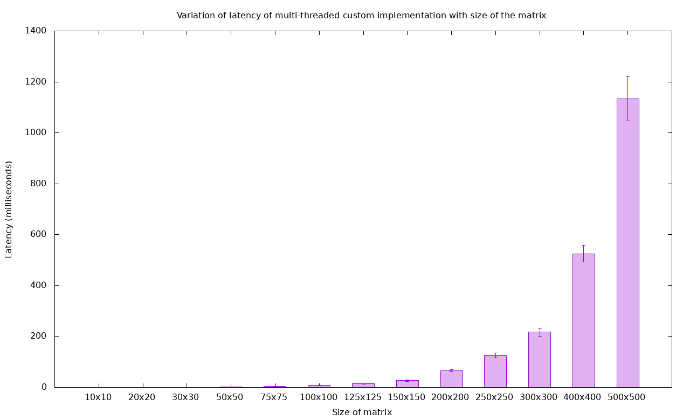
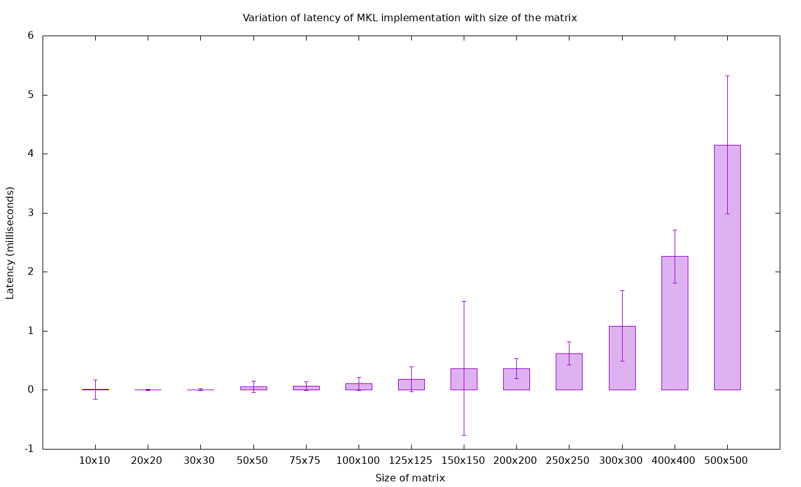
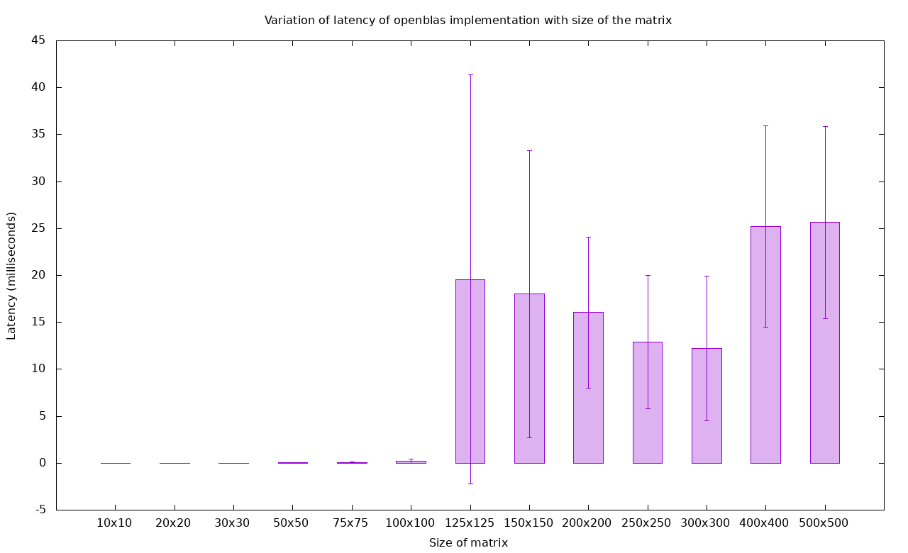

# COP290
Course repository ( Chinmay Mittal, 2020CS10336 and Tanish Tuteja 2020CS10398) for COP-290  (Design Practices), 4th Semester IIT Delhi

---

## Task1: Audio Processing Library

### Subtask-1 

Four functions are supported currently

* Fully Connected Layer, takes an input matrix, multiplies by a weight matrix and add a bias matrix
* Activation, term wise activation of a matrix. Currently supports ReLU and tanh actviation functions
* Pooling Layer, takes an input matrix and stride and performs pooling, currently supports max pooling and average pooling
* Probability takes a vector as an input and converts it to a probability vector, currently supports sigmoid and softmax

---

### Running the code

` make `

This creates the executable in yourcode.out

` make clean `

This deletes all object files and the yourcode.out executable

The arguments or function calls are passed as command line arguments

For fully connected layer, 

` ./yourcode.out fullyconnected inputmatrix.txt weightmatrix.txt biasmatrix.txt outputmatrix.txt`

---

For activation module,

` ./yourcode.out activation [type] inputmatrix.txt outputmatrix.txt`

type can be one among the following 

* relu
* tanh
---
For pooling module,

` ./yourcode.out pooling [type] inputmatrix.txt [stride] outputmatrix.txt`

type can be one among the following

* average 
* max

stride is a positive integer and the filter size is assumed to be stride*stride

---

For probability module,

` ./yourcode.out probability [type] inputvector.txt outputvector.txt`

type can be one among the following

* sigmoid
* softmax

---

### Error Handling

The following error handling is done

1. Invalid function call arguments
    
    * if wrong function name is passed program terminates
    * if wrong type argument is passed program terminates 
    * output file if not present is creaed, otherwise is overwritten
    * if any input file is not present, program terminates
    * If arguments are less than expected, program terminates

2. Formatting errors

    * Each line of input file is expected to have one token, integer or float number, else program terminates
    * Matrix Dimensions should be correct, positive integers otherwise program terminates

3. Others

    * Invalid dimensions of matrix during multiplication or addition 

---

### Additional Info and Design Choices

The program files are kept seperate from each other, and header files are created wherever required for modularity.

The make command creates the object files seperately and are linked together at the end during creation of the executable. This avoids large coompile times during debugging and development.

Vectors and matrices are passed as reference, wherever possible, to avoid large copy times.

Seperate files are created for pooling / matrix algebra / activation / fileIO etc. The main program is file.cpp, which calls these functions, whenever required.

The program is commented to facilitate readibility.

---
### Subtask-2 ( Code performance and learning through plotting scripts )

---

Improving the effeciency of fully connected layer's matrix operations using : 

1. Opensource implementations such as openblas and Intel MKL
2. Parallelization of our implementation using pthreads

---

### Running the code

` make `

This creates the required object files and three executables ` yourcode.out `,  ` openblas_mm.out`  and `randomMat.out`

` make clean `

This deletes all object files and the executables

***Note***: Both intel MKL and openblas have the same function prototype for matrix multiplication. To avoid conficts of function definition during linking of seperate object files into a single executable, we have decided to create two seperate executables one of which handles the openblas implementation  ( ` openblas_mm.out ` ) and the other handles all other implementations ( ` yourcode.out `). 

The third executable randomMat.out is used to generate random matrices to compare and plot latencies across different implementations.

For other modules ( pooling/activation/probabiltiy), all the commands to execute the code remains same as in subtask-1 ( uses `yourcode.out` ).

For the naive implementation of fullyconnected module the commands remain same ( uses `yourcode.out` )

For other optimization routines additional command line arguments can be provided as follows: 

1. ` ./yourcode.out fullyconnected inputmatrix.txt weightmatrix.txt biasmatrix.txt outputmatrix.txt [optimization]`

    This supports the following: 

    *  INTEL MKL

    `   ./yourcode.out fullyconnected inputmatrix.txt weightmatrix.txt biasmatrix.txt outputmatrix.txt mkl`

    *    pthread

    ` . /yourcode.out fullyconnected inputmatrix.txt weightmatrix.txt biasmatrix.txt outputmatrix.txt pthread`


2. ` ./openblas_mm.out fullyconnected inputmatrix.txt weightmatrix.txt biasmatrix.txt outputmatrix.txt openblas`

    This executable only supports openblas optimization routine.


---

### Design Choices for Subtask-2

* Timing files and headers have been created, to ensure uniformity of timing computations across all implementations.

* Parallelization using pthreads

    * The work of each thread is divided so as to prevent data conficts. 

    * Matrix multiplication A * B can be seperated into multiplication of each row of A with the entire matrix B forming each row of the result from each row of A. This has been used to divide the work among threads with each thread doing the computation assosciated with one or more rows of the output matrix.

    * To prevent a large number of threads from being computed , we restrict the maximum threads to 8 .

    * Thread $ i $ computes the results associated with all rows $ 1 \leq j = i + (8*k ) \leq n $, of the output matrix i.e. all rows differing by multiples of 8 where n is the number of rows in the resultant matrix and k is a whole number.

<p align="center">
<br>
Threaded matrix mulitplication
</p>

---

### Generating the plots
To compute latencies for all the implementations, a set of pre defined random matrices is needed. To aid this, we have the `randomMat.out` which works in 2 modes (one and multi) as follows:
```
./randomMat.out one <nrows> [ncols [outFile [maxVal]]]

./randomMat.out mult <nmats> <nrows> [ncols [maxVal]]
```
For a given size, we need 3 random matrices A, B, C to perform A * B + C and compute the latency. Thus, we run
```
./randomMat.out mult 3 size
```
This will generate 3 matrices with the names mat*size*x*size*_0, mat*size*x*size*_1, mat*size*x*size*_2. Note that the matrices on which tests have been performed are included in the folder. 
Now we run the following commands to generate latencies for these matrices:
```
./yourcode.out calclatency
./openblas_mm.out calclatency
```
This will output a `.dat` file for each implementation which contains all the latency data. Note that matrix file names have been hardcoded inside the file so to calculate latency of sizes other than (10x10, 20x20, 50x50, 100x100, 200x200) the `latency_consts.h` file needs to be modified.
Finally to visualize this data, run
```
gnuplot ./gen_plots.plt
```
This will output PNG and EPS files for each implementation to the `plots` directory.

---

### Results

The results are included in the plots folder. We have included plots for 4 cases 

1. Naive Implementation 

<p align="center">
<br>
Naive matrix mulitplication
</p>

2. Threaded Implementation using pthreads

<p align="center">
<br>
Multithreaded matrix mulitplication
</p>


3. Intel MKL implementation 

<p align="center">
<br>
Intel MKL implementation 
</p>

4. Openblas implementation. 

<p align="center">
<br>
Openblas implementation 
</p>

Observations: 

1. Efficiency of implementations: 

>   INTEL MKL > OPENBLAS > PTHREADS > NAIVE 

2. For each plot, we use random matrices of different dimensions. For a given dimension we generate a random matrix and test the optimization technique 500 times on the same matrix, we calculate the latencies and standard deviation using these timing values. 

3. Since threading divides the matrix work among different threads, the timings are generally better by a constant factor (2-3) compared to the naive implementation. The timings increase with repects to the third order of the size of the matrix as expected by the algorithm implementation. But our method does not match library implementations given they utilize hardware resources much better, and not just simple parallelization.

4. For smaller matrices there is not much difference in any implementation, it is for the larger matrices that the difference in timings shows up.

5. Openblas shows abnormal behaviour with timings decreasing for certain matrix sizes.