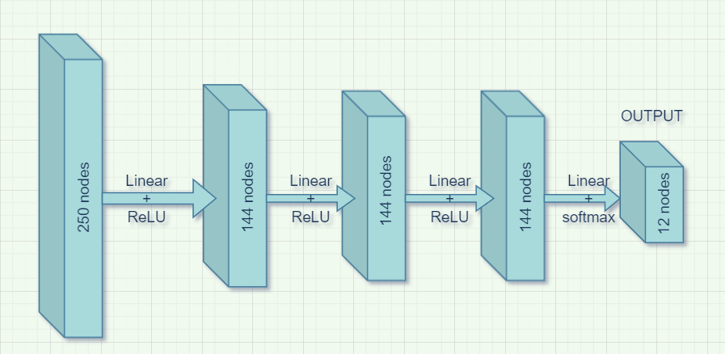

# COP290
Course repository ( Chinmay Mittal, 2020CS10336 and Tanish Tuteja 2020CS10398) for COP-290  (Design Practices), 4th Semester IIT Delhi

---

## Task1: Audio Processing Library

### Subtask-3 ( Hierarchical code design, creating library and API )

--- 

***Objective*** : Implement a deep neural network (DNN) inference for classifying across 12 audio keywords (silence, unknown, yes, no, up, down, left, right, on, off, stop, go). 

<p align="center">
<br>
Neural Network Architecture 
</p>

We use INTEL MKL, which is the fastest implementation from Subtask2 for fullyconnected layers and our own softmax implementation for the prediction layer

### How to run the program 
 ---

One needs to set ```MKL_BLAS_PATH```, the environment variable which specifies the path to intel mkl library

```bash
export MKL_BLAS_PATH=/opt
```


This environment variable will be used in the Makefile to link the math kernel library 

```bash
MKL_LIB_DIR = $(MKL_BLAS_PATH)/intel/oneapi/mkl/2022.0.2/lib/intel64
MKL_INCLUDE_DIR = $(MKL_BLAS_PATH)/intel/oneapi/mkl/2022.0.2/include
```

Type make to create the shared object file  (```libaudio.so```) and the main executable (```yourcode.out```) to run the program which uses the library object file 

To run the program use the following command 

./yourcode.out [input_feature_file] [output_prediction_file]

Eg
```bash
./yourcode.out mfcc_features/695c2127_nohash_0.txt out.txt
```

The output will be appended at the end of the text file specified as follows 

```txt
mfcc_features/695c2127_nohash_0.txt on _unknown_ off 0.998223 0.00142287 0.000338539 

```

### Description of libaudio Library 
---

The main file for this library is ```ann.cpp```, this file uses the mkl implementation ( refer ```optimization.h``` and ```mklopt.cpp```) for fullyconnected layer computations and our custom implementation for softmax layer ( refer ```softmax.cpp``` and ```softmax.h```). 

The pretrained weights are present in ```dnn_weights.h``` ( as 1-D vectors ), ```ann.cpp``` converts these 1-D vectors to matrices of appropriate size for the matrix multiplication operations in the Neural Network, the relevant function and header for this conversion are present in ```matarr.cpp``` and ```matarr.h```.

The output datatype definition and function prototype, which are required by users of this library are present in ```interfaceNN.h``` as follows

```cpp
typedef struct
{
    int label;
    float prob;
} pred_t;

void libaudioAPI(const char *audiofeatures, pred_t *pred);


```

This file needs to be included in the project by external users. Along wtih including this header one also has to link the dynamic library libaudio.so

### Error Handling 
---

1. In case the input file does not exist the program terminates gracefully and an error message is shown on the console 

2. In case the output file cannot open an error message is produced

3. In case of invalid command line arguments an error message is produced